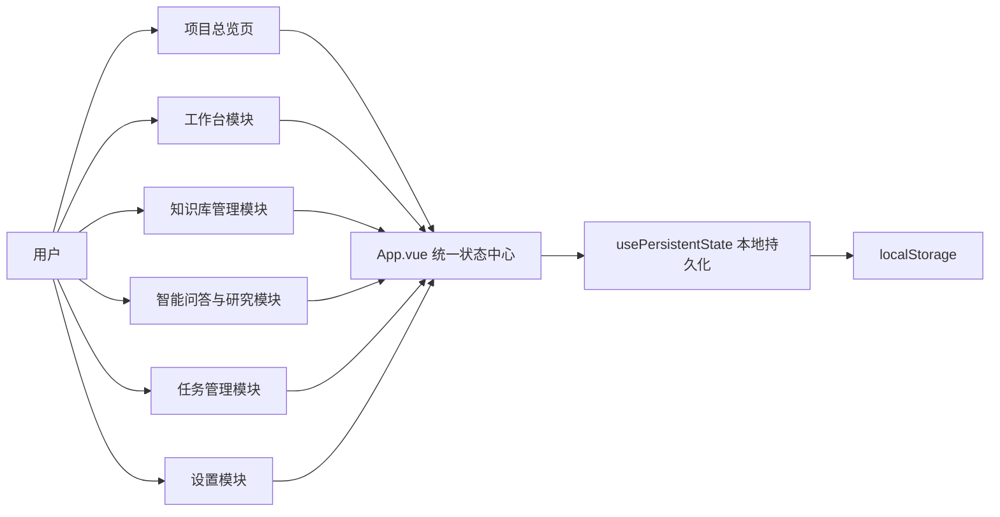
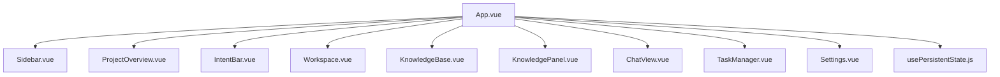
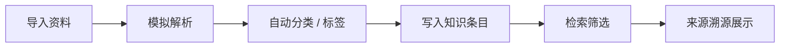
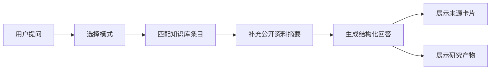

# 系统架构说明

## 架构概述
本项目采用前端原型架构，以 `Vue 3 + Vite` 为核心，使用组件化方式组织页面，并通过本地持久化模拟知识库、问答、任务和工作台数据流。

当前版本目标不是生产级部署，而是用于课程答辩展示一个结构完整、逻辑清晰、可扩展的 AI 学习助手系统。

## 总体架构图

## 模块关系图

## 数据流说明

### 1. 状态中心
`App.vue` 统一管理以下核心数据：
- 工作台卡片
- 知识库列表
- 知识条目
- 导入记录
- 对话消息
- 任务列表
- 设置项

### 2. 持久化机制
通过 `usePersistentState.js` 把核心状态同步到 `localStorage`，保证刷新页面后数据不会丢失。

### 3. 组件交互方式
- 父组件 `App.vue` 持有数据
- 子组件通过 `props` 接收数据
- 子组件通过 `emit` 触发操作事件
- `App.vue` 负责统一更新状态

## 核心功能链路

### 知识库链路

### 问答链路

## 页面职责

### 1. ProjectOverview.vue
- 展示系统定位
- 汇总项目统计信息
- 作为答辩入口页

### 2. Workspace.vue
- 组织答辩材料和项目记录
- 支持卡片化收纳与排序

### 3. KnowledgeBase.vue
- 展示知识库与条目
- 模拟资料导入与智能整理
- 支持筛选、搜索、溯源

### 4. ChatView.vue
- 展示双源问答
- 展示深度研究结果
- 展示多模态理解能力入口

### 5. TaskManager.vue
- 展示期末收尾任务
- 支持优先级和状态管理

### 6. Settings.vue
- 提供主题切换
- 提供数据导出与恢复

## 当前架构特点
- 结构清晰，适合课程答辩说明
- 模块划分明确，页面职责单一
- 状态管理集中，便于后续扩展
- 支持从前端原型平滑演进到前后端分离系统

## 后续可扩展架构
后续若继续完善，可扩展为：
- 后端 API 服务层
- 数据库存储层
- 文件解析服务
- OCR / 语音转写服务
- 向量检索与 RAG 问答层
- 用户权限与团队协作系统
- 微信 / 腾讯文档生态接入层

## 答辩时推荐怎么讲架构
可以用一句话概括：

“我的项目采用组件化前端架构，由 App 统一管理核心状态，各功能模块围绕知识库、问答、工作台和任务管理展开，并通过本地持久化模拟真实系统的数据流，这样既保证了展示完整性，也为后续接入后端留下了清晰扩展路径。”
